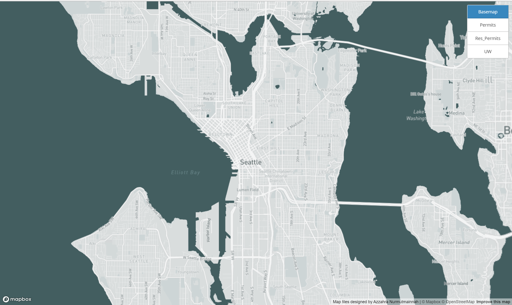
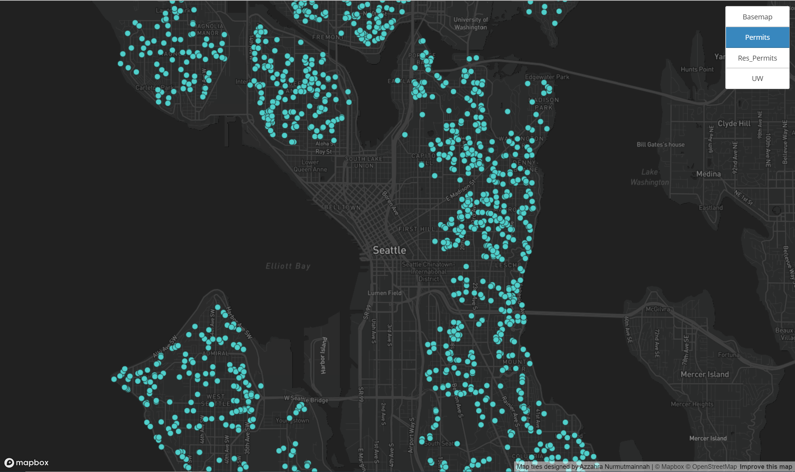
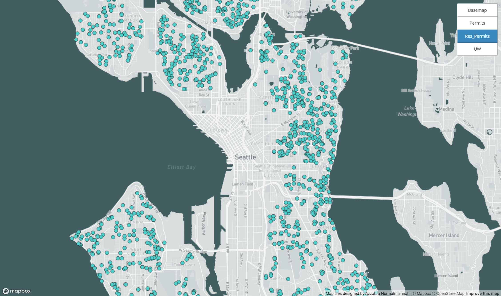
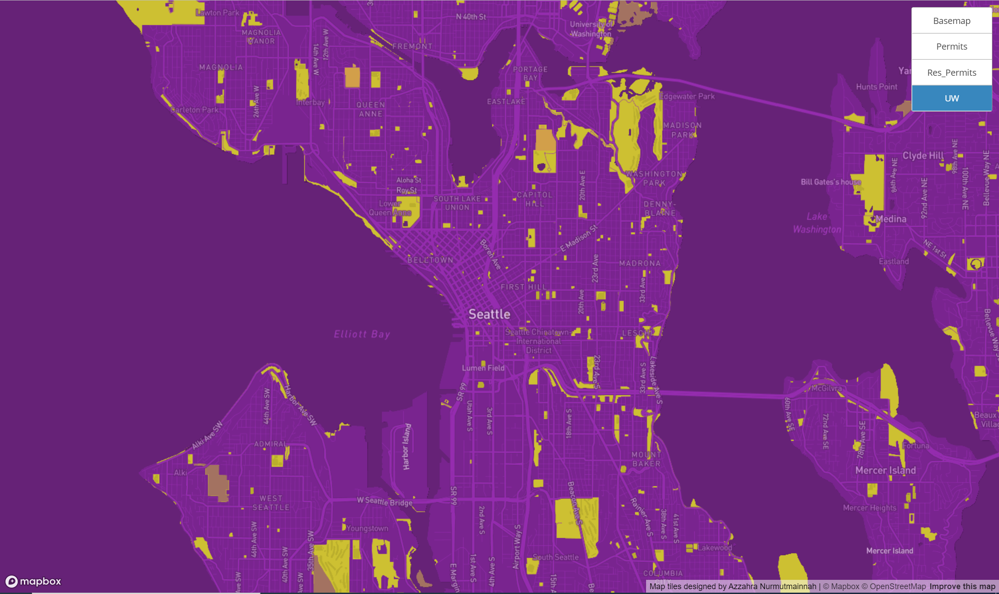

# Map-Design-Tile-Generation

## Tile 1 - Basemap

- Description: This basemap is showing Seattle to simplify the map without highlighting all the different areas.
- Area OF Focus: Seattle, WA
- Zoom Level: 12

## Tile 2 - Map Data (Residential Permit, Seattle)

- Description: This layer shows the Residential Permit that were handed out in the last decade
- Area of Focus: Seattle, Washington
- Zoom Level: 12

## Tile 3 - Basemap and Data 

- Description: This map shows the map the basemap and the data combine together to make one map. 
- Area of Focus: Seattle, Washington 
- Zoom Level: 12
## Tile 4 - UW

- Description of Tile: The theme of this map is UW to match the color of the school 
- Geographic Area of Focus: Seattle, Washington
- Zoom Level: 12
